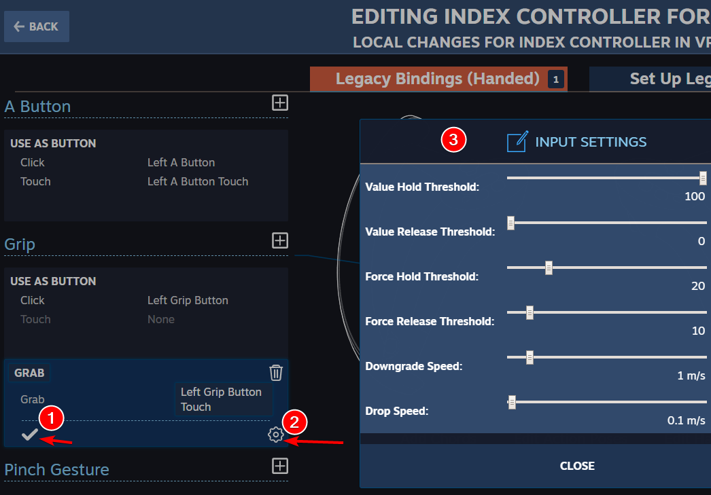

# Valve Index 控制器

VRChat支持Valve Index控制器！

## 手指姿态

Valve Index控制器包含了小拇指、无名指和中指的电容传感器，可以检测这三根手指的姿态。它还包含了扳机上的食指电容传感器和触摸板/按键上的传感器，可以检测您的大拇指是否“按下”。最后，它还包含了一个压力传感器来检测用户是否紧握控制器。

在VRChat中，角色手上的手指姿态会实时检测控制器的状态。尽管跟踪不是完全精确的,但手指的开合状态可以反映到您的角色手上，提升沉浸感。

## 手势切换

当您启用手势切换时，VRChat会尝试根据您当前的手指姿态，匹配标准的VRChat手势。任何指定的手势动画都会被触发，但是您的手势不会自动改变，即使您为手的位置定义了一个手势动画。

当您禁用手势切换时，VRChat不会尝试匹配手势。

如果你在触发一个手势动画时关闭手势切换，那个手势动画会继续播放，直到您再次启用手势切换。

## 物体交互

抓取物体(比如Battle Discs中的盘子)是通过握紧手柄来完成的。松开握持会让物体掉落。使用Valve Index手柄可以让像Battle Discs这样的游戏感觉更沉浸和自然。握持力度的要求可以和许多其他设置一起进行调整。

## 设置默认的键位绑定

确保您在SteamVR设置>控制器绑定>VRChat菜单中，为Index控制器使用“VRChat bindings for Index Controller”。这一点非常重要——如果你正在使用Index控制器的旧自定义设置，它们将无法正常工作！

SteamVR控制器绑定页面可能有点bug，所以确保在您选择绑定后它们已正确设置。

这些绑定已经被设置为VRChat的“默认绑定”。您可以在SteamVR控制器设置中找到它们。不过您可能需要在SteamVR中使用“使用旧版绑定界面（Use Old Binding UI）”按钮。

您也可以在SteamVR控制器绑定菜单中调整多种设置，包括抓取所需的力度。如果您觉得有些东西不对劲，也选择可以调整这些设置。如果您找到了自己喜欢的设置方案，您可以使用SteamVR将这些绑定方案共享给其他人！

<figure><figcaption>
如果闭合您的小拇指/无名指/中指有点困难，您可以试着在握持绑定上的“保持力度（Force Hold）”和“释放力度（Force Release）”设置中将值调低。
</figcaption></figure>

## 自定义绑定说明

在重新分配"可触摸的拇指"按钮触摸事件时要小心。VRChat会检查拇指可以触摸的每个按钮的触摸事件，来判断拇指是否弯曲。如果一个"可触摸的拇指"按钮没有分配相同的触摸事件，VRChat就无法判断拇指已经弯曲，这将导致跟踪不准确。

跳跃、麦克风切换、手势切换以及动作菜单左/右，这些都是对应用程序的硬输入绑定。

## VRChat标准手势

<table><thead><tr><th width="353">手势名称</th><th width="397">手势描述</th><th data-hidden></th><th data-hidden></th></tr></thead><tbody><tr><td>握拳</td><td>小拇指、无名指和中指闭合 食指放在扳机上 大拇指闭合</td><td></td><td></td></tr><tr><td>张开手</td><td>小拇指、无名指和中指抬起 食指离开扳机 大拇指抬起</td><td></td><td></td></tr><tr><td>指向</td><td>小拇指、无名指和中指闭合 食指离开扳机 大拇指闭合</td><td></td><td></td></tr><tr><td>竖大拇指</td><td>小拇指、无名指和中指闭合 食指放在扳机上 大拇指抬起</td><td></td><td></td></tr><tr><td>剪刀手</td><td>小拇指、无名指闭合，中指抬起 食指离开扳机 大拇指闭合</td><td></td><td></td></tr><tr><td>手枪</td><td>小拇指、无名指和中指闭合 食指离开扳机 大拇指抬起</td><td></td><td></td></tr><tr><td>摇滚</td><td>小拇指抬起，无名指和中指闭合 食指离开扳机 大拇指闭合</td><td></td><td></td></tr></tbody></table>

<table><thead><tr><th>按键</th><th>效果</th><th data-hidden>效果</th><th data-hidden></th></tr></thead><tbody><tr><td>右侧A（右侧手柄底部按键）</td><td>跳跃</td><td></td><td></td></tr><tr><td>左侧A（左侧手柄底部按键）</td><td>静音</td><td></td><td></td></tr><tr><td>B（手柄顶部按键）</td><td>
快捷菜单

行动菜单（按住）
</td><td></td><td></td></tr><tr><td>触摸板触摸</td><td>为未来的特性保留（目前无效果）</td><td></td><td></td></tr><tr><td>触摸板按下</td><td>为未来的特性保留（目前无效果）</td><td></td><td></td></tr><tr><td>触摸板滑动</td><td>为未来的特性保留（目前无效果）</td><td></td><td></td></tr><tr><td>握持</td><td>捡起</td><td></td><td></td></tr><tr><td>扳机</td><td>选择/交互</td><td></td><td></td></tr><tr><td>右摇杆</td><td>转向</td><td></td><td></td></tr><tr><td>左摇杆</td><td>移动</td><td></td><td></td></tr><tr><td>右摇杆下压</td><td>右侧动作菜单</td><td></td><td></td></tr><tr><td>左摇杆下压</td><td>左侧动作菜单</td><td></td><td></td></tr></tbody></table>

## 调整说明（高级）

VRChat使用Unity的Mechanim和Mixamo的"YBot"角色作为标准的绑定设置。随着手指灵巧性的提高，对手部绑定的要求也增加了，你可能需要调整绑定和绘制权重。一个测试的好方法是使用Unity的 Avatar Muscles 和 Settings 选项卡来测试手部的张开/闭合状态。如果手部姿势看起来有些奇怪，你可能需要稍微调整你的权重绘制和绑定设置。

